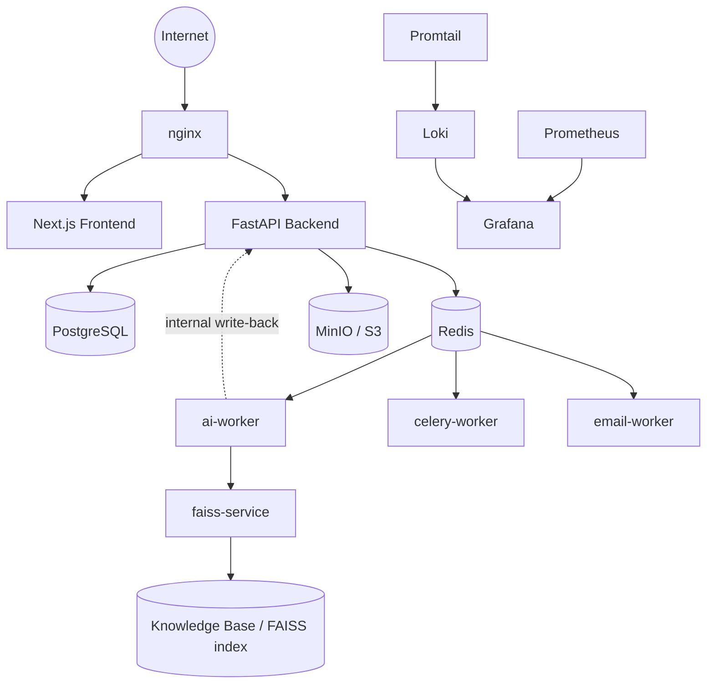

# Diagrams

Source diagrams for this project, in [Mermaid](https://mermaid.js.org/)
syntax. GitHub and most modern Markdown viewers render Mermaid code
blocks natively — no extra tooling needed to view them. Raw `.mmd`
source files are also kept alongside this README for use with the
[Mermaid Live Editor](https://mermaid.live) or any other Mermaid-based
tool.

**Verification note, stated honestly:** these were checked for syntax
correctness by hand against Mermaid's documented flowchart grammar
(quoted node labels, ` ` for line breaks instead of literal `\n`,
labeled edges via `-->|"label"|`) — no headless-browser rendering tool
was available in this environment to actually render and visually
confirm them (Puppeteer requires downloading Chrome, which this
environment's network restrictions don't allow). If either diagram fails
to render somewhere, that's a real gap to fix, not something already
confirmed working.

## System architecture

See `system-architecture.mmd`.

## AI pipeline

See `ai-pipeline.mmd`.

```mermaid
flowchart LR
    Ticket["New ticket / follow-up message"] --> Router["Router node<br/>intent + category classification"]
    Router --> Specialist["Specialist node<br/>RAG retrieval + draft answer"]
    Specialist --> Supervisor["Supervisor node<br/>confidence scoring + decision"]
    Supervisor -->|"auto_respond"| WriteBack["Write-back to backend"]
    Supervisor -->|"clarify"| WriteBack
    Supervisor -->|"escalate"| WriteBack
    WriteBack -->|"auto_respond / clarify"| StudentSees["Student sees answer"]
    WriteBack -->|"escalate"| RoutingLookup["Routing rule lookup by category"]
    RoutingLookup --> FacultyQueue["Assigned to faculty member"]
    FacultyQueue --> FacultyResponds["Faculty responds"]
    FacultyResponds -->|"marked verified"| LearningAgent["Learning Agent"]
    LearningAgent --> Reindex["Re-index into knowledge base"]
    Reindex -.-> Specialist
```

